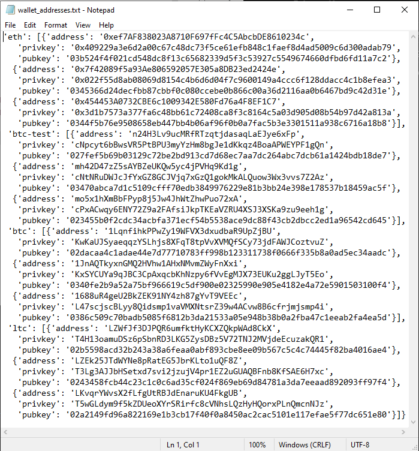

# Wallet


The objective of this repository is to design a wallet that can send either testnet bitcoin or testnet ethereum crytpocurrencies to any counterpart address that meet the requirementes of the network.

In addition to that, the wallet has provisions to execute transactions with real bitcoin.

The wallet is comprised of 3 sections:

&ensp; **Section 1:** Address derive, which includes generating 3 children wallets (or 3 set of addresses) for four Crypto currency Networks: Bitcoin (BTC), Bitcoin-testnet (BTCTEST), Ethereum (ETH) and Litecoin (LTC).  

&ensp; **Section 2:** Transactions execution along the testnet bitcoin network (btc-test).

&ensp; **Section 3:** Transaction executions along the local Ethereum Network (katchcoin).

## Section 1 - Address Derive

This section consists of one function designed to generate the address, private key and public key of any cryptocurrency based on input the mnemonic phrase. the function defaults in generating 3 set of keys.


The function named: `derive_wallets` (code below) relies on the `hd-wallet-derive` library (for installation and required dependencies, press here). 
```python
def derive_wallets(coin_name, mnemonic=mnemonic ,numb_derive=3):
    command = f'php derive -g --mnemonic="{mnemonic}" --cols=address,privkey,pubkey --numderive={numb_derive} --coin={coin_name} --format=json'
    p =subprocess.Popen(command, stdout=subprocess.PIPE, shell=True)
    (output, err) =p.communicate()
    p.wait()
    keys = json.loads(output)
    return keys
```
Furthermore, the function was used to generate the addresses and key pairs from a mnemonic phrase located in the .env file. Those addresses were used to operate the wallet (complete transactions). Table 1 has btc-test (Bitcoin testnet) generated addresses, while the whole wallet derived addresses are in [wallet_addresses.txt](https://github.com/CacheKatch/wallet/blob/main/wallet_addresses.txt)
```python
coins={"eth":derive_wallets(ETH),
    "btc-test":derive_wallets(BTCTEST),
    "btc":derive_wallets(BTC),
    "ltc":derive_wallets(LTC)}
```

## Section 2 - Transactions with Bitcoin Testnet


The next task was to design functions that could be called to send cryptocurrencies from the previously generated crypto addresses (children wallets from the main mnemonic phrase).

The 3 functions are: 

&ensp; 1) priv_key_to_account: that reveals the public address based on the private key input. 

&ensp; 2) create_tx: that prepares offline the transaction, with the inputs of: sender private key, recipient address, amount, and coin (currency). when this function runs succesfully, prints out a `string` with the sender address. 

&ensp; 3) send_tx: this function essentially broadcast the transaction to the corresponding cryptocurrency network. When this function runs succesfully, it prints out a message `transaction successful` along with the coin and the amount of the transaction.

In addition to that a fourth function was designed to use in cases when the transaction id is desired. This functions is called `send_tx_id`. 


<p style="text-align: center;"> <font size="4"> Table 1 - Bit-test derived addresses </font></p>

<table>
  <tr>
    <td><font size="3">Add No. </font></td>
    <td><font size="4">Address </font></td>
    <td><font size="4">Private Key</font></td>
    <td><font size="4">Public Key </font></td>
  </tr>
  <tr>
    <td><font size="2">1</font></td>
    <td><font size="2">n24H3Lv9ucMRfRTzqtjdasaqLaEJye6xFp</font></td>
    <td><font size="2">cNpcyt6bBwsVR5PtBPU3myYzHm8bgJe1dKkqz4BoaAPWEYPF1gQn</font></td>
    <td><font size="2">027fef5b69b03129c72be2bd913cd7d68ec7aa7dc264abc7dcb61a1424bdb18de7</font></td>
  </tr>
  <tr>
    <td><font size="2">2</font></td>
    <td><font size="2">mh42D47zZ5sAYBZeUKQw5yc4jPVHq9Kd1g</font></td>
    <td><font size="2">cNtNRuDWJcJfYxGZ8GCJVjq7xGzQ1gokMkALQuow3Wx3vvs7Z2Az</font></td>
    <td><font size="2">03470abca7d1c5109cfff70edb3849976229e81b3bb24e398e178537b18459ac5f</font></td>
  </tr>
  <tr>
    <td><font size="2">3</font></td>
    <td><font size="2">mo5x1hXmBbFPyp8j5Jw4JhWtZhwPuo72xA</font></td>
    <td><font size="2">cPxACwqy6ENY72Z9a2FAfsiJkpTKEaVZRU4XSJ3XSKa9zu9eeh1g</font></td>
    <td><font size="2">023455b0f2cdc34acbfa371ecf54b5538ace9dc88f43cb2dbcc2ed1a96542cd645</font></td>
  </tr>
  
</table>

## Libraries and Dependencies

To operate the wallet, the following [requirements](https://github.com/CacheKatch/wallet/blob/main/requirements.txt) need to be installed in the computer.

In addition, `hd-wallet-derive` library must be installed prior to running the wallet_derive function. Instructions to install hd-wallet-derive are [here](HD_Wallet_Derive_Install_Guide.md)

## Resources

1) [Trilogy Education Services](https://www.trilogyed.com/)
2) [crypto gif](https://icons8.com/preloaders/en/cryptocurrency_and_money/)